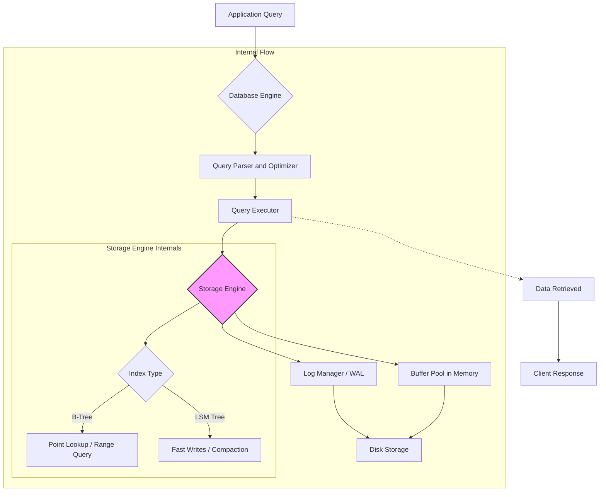

## Why This Exists

Data models exist to bridge the gap between the user's mental model of their application data and the physical storage system. Without a defined model, every application would have to manually handle the complex tasks of indexing, concurrency, and data integrity, leading to massive redundancy and fragility. They provide a standardized way to structure, query, and enforce rules on data, turning raw storage into a meaningful and manageable asset.

## Core Concept

A data model is a conceptual framework that dictates how data is organized, stored, and manipulated. Think of it as the blueprint for your database. It defines the "shape" of your data: Are they rigid tables, flexible JSON documents, or a web of interconnected nodes? The choice determines how you model relationships (e.g., foreign keys vs. nested objects), enforce constraints (e.g., data types), and write queries. The main families are **Relational** (SQL, table-based), **Document** (NoSQL, JSON-like), **Key-Value** (hash maps), **Graph** (nodes and edges), and **Wide-Column** (hybrid of relational and key-value).

## Internal Working

The internal workings are implemented by the database engine's **Query Processor** and **Storage Engine**.

1.  **Query Parsing & Planning:** The query (e.g., SQL) is parsed into a parse tree, checked for syntax and permissions, and then optimized. The optimizer generates an execution plan, deciding *how* to fetch the data (e.g., use an index or scan the whole table) and *when* to join different datasets.
2.  **Execution & Data Access:** The executor follows the plan, making calls to the storage engine. The storage engine, in turn, manages data on disk.
    - **B-Tree Indexing (Relational/Document):** Most relational and document databases use B-Trees for primary and secondary indexes. When you query a column with an index, the engine traverses the B-Tree to find the pointer to the physical disk block containing the row. This provides O(log n) search, insert, and delete performance.
    - **LSM Trees (Wide-Column/Key-Value):** For high-write throughput, databases like Cassandra use Log-Structured Merge-Trees. Writes are appended to an in-memory structure (memtable) and a persistent log for durability. When the memtable is full, it's flushed to disk as an immutable SSTable (Sorted String Table). The engine periodically merges (compacts) SSTables to remove duplicates and keep reads efficient.
3.  **Data Representation:** On disk, records are stored in a format like a page-oriented heap file (relational) or encoded as binary JSON (BSON in MongoDB). The engine must manage page allocation, fragmentation, and free space. Data is loaded into memory via the Buffer Pool to minimize slow disk I/O.

## Real-World Use Case

- **Named Company (Uber):** Uber uses a polyglot persistence approach. They use **MySQL (Relational)** for critical financial transactions and driver/city operations. For high-scale, low-latency leaderboard and messaging features, they rely on **Redis (Key-Value)** . For their complex real-time pricing and routing, they initially used graph databases like Neo4j to find the best routes and connections between locations and drivers.
- **Generic Industry Scenario (E-commerce Checkout):** When a user adds items to their cart, a **Document Database (e.g., MongoDB)** is perfect. The cart can be stored as a single JSON document containing the user ID, a list of product IDs and quantities, and a total price. This avoids complex SQL joins between `carts`, `cart_items`, and `products` tables, leading to faster writes and a simpler data model for the developer. When the user proceeds to payment and the order is finalized, the data is moved to a **Relational Database** to ensure strict ACID (Atomicity, Consistency, Isolation, Durability) compliance for financial records.

## Mental Model

Imagine building a city. **Relational models** are like a city grid with rigidly defined, interconnected plots (tables). You need a standardized address system (foreign keys) and rules for what can be built on each plot (schema). **Document models** are like shipping containers; each container (document) has its own internal structure, and you can store a large variety of items within, as long as you know the container ID. **Key-Value stores** are a giant, super-fast coat check room where you get a ticket (key) for your coat (value), but you can't ask for all red coats. The city planner (your app) chooses the model that best balances flexibility and order for the task at hand.

## Diagram



## Syntax & Example

Here is an example contrasting a relational model with a document model for an e-commerce cart.

**Relational (PostgreSQL):**
```sql
-- Schema is rigid. Adding a new attribute requires a schema migration.
CREATE TABLE users (id SERIAL PRIMARY KEY, name TEXT);
CREATE TABLE carts (id SERIAL PRIMARY KEY, user_id INT REFERENCES users(id));
CREATE TABLE cart_items (
    id SERIAL PRIMARY KEY,
    cart_id INT REFERENCES carts(id),
    product_id INT,
    quantity INT
);

-- Query to get a user's cart: Requires multiple joins.
SELECT u.name, p.product_name, ci.quantity
FROM users u
JOIN carts c ON u.id = c.user_id
JOIN cart_items ci ON c.id = ci.cart_id
JOIN products p ON ci.product_id = p.id
WHERE u.id = 123;
```

**Document (MongoDB):**
```javascript
// Schema is flexible. A cart is a single document.
db.carts.insertOne({
  user_id: 123,
  items: [
    { product_id: 101, name: "Laptop", quantity: 1, price: 1200 },
    { product_id: 102, name: "Mouse", quantity: 2, price: 25 }
  ],
  total: 1250,
  created_at: new Date()
});

// Query: Single read to fetch the entire cart.
// This is an atomic operation on the document.
db.carts.findOne({ user_id: 123 });
```

## Gotchas / Common Confusions

1.  **"NoSQL means no relationships":** NoSQL databases *can* handle relationships, but they are either denormalized (embedded) or handled via application-side joins. The model forces you to decide upfront: embed (fast, but data duplication) or reference (normalized, but requires multiple queries).
2.  **"The data model is just about storage":** The data model fundamentally dictates your query patterns. A data model optimized for "write-heavy" logging (e.g., wide-column) will perform terribly for complex, ad-hoc "read-heavy" analytics (e.g., relational OLAP).
3.  **"Schema-on-read vs. Schema-on-write":** Relational databases enforce schema-on-write (data must conform). Document databases enforce schema-on-read (the application interprets the data structure). This means a document DB can store mismatched data, leading to logic errors in the application if not carefully managed.
4.  **"ACID is impossible without SQL":** This is false. Some NoSQL databases (like MongoDB) have added multi-document ACID transactions. However, the *performance cost* is higher than in a relational DB, and you often trade consistency for availability (CAP theorem).
5.  **"Normalization is always best":** In document databases, over-normalization (separating everything into different collections) destroys performance. The primary benefit is the ability to embed and pre-join data. Applying relational normalization rules to document modeling is a common architectural antipattern.

## Interview Angle

1.  **Q: How do you decide between a relational and a document database for a new project?**
    - *Hint:* Consider schema rigidity, relationship complexity, and scaling requirements. Relational for strong consistency/complex joins; Document for schema flexibility, horizontal scaling, and data locality.
2.  **Q: What is an LSM Tree and why would you choose it over a B-Tree?**
    - *Hint:* LSM Trees are optimized for write throughput by turning random writes into sequential writes. They are used in systems like Cassandra and LevelDB. B-Trees have better read performance.
3.  **Q: Explain the CAP theorem and how it influences data model choice.**
    - *Hint:* Distributed systems can only choose two: Consistency, Availability, Partition Tolerance. Most NoSQL systems choose AP (Availability and Partition Tolerance), while relational clusters often focus on CP.
4.  **Q: What is denormalization and when is it a good idea?**
    - *Hint:* Storing duplicate data to avoid joins. Good for high-read, low-write scenarios, but introduces update anomalies and makes writes more complex.
5.  **Q: How does indexing work internally in a relational database?**
    - *Hint:* B-Tree data structure. The tree is stored on disk. A `SELECT` query traverses the tree using the index key to find the exact page/row location (primary key pointer), reducing the time from O(n) to O(log n).
6.  **Q: What is a graph database and what problem is it uniquely good at solving?**
    - *Hint:* Social networks, recommendation engines, fraud detection. It excels when the relationship between data points is as important as the data itself, allowing for traversal queries (e.g., "friends of friends").
7.  **Q: Explain the difference between a primary index and a secondary index.**
    - *Hint:* Primary index is on the primary key and physically reorders the table (clustered) or is a direct pointer. Secondary indexes point to the primary key value, requiring an extra lookup to fetch the data.
8.  **Q: What is the "impedance mismatch" between object-oriented code and relational databases?**
    - *Hint:* Object models have inheritance and nested structures; relational models have tables and rows. ORMs like Hibernate try to bridge this but often create performance issues (like the N+1 query problem) because of the fundamental model difference.

## Quick Recall

**"CRUD the Model"** : **C**ore model dictates **R**elationships and **U**se-case, which drives the **D**ata-structure and denormalization strategy. If it's SQL, think B-Trees and ACID. If it's NoSQL, think LSM Trees and CAP theorem.