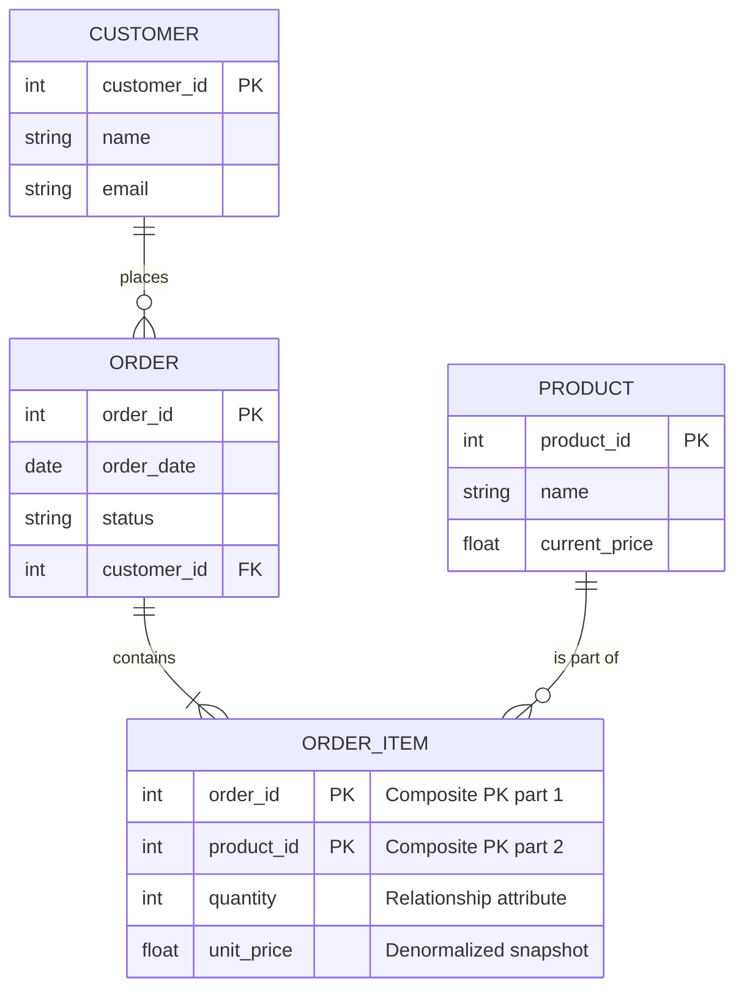

## Why This Exists

The ER Model exists to solve the "architect vs. builder" communication gap. Business stakeholders think in terms of concepts (Customers, Orders, Products), while database engineers think in terms of tables, indexes, and bytes. Without a visual, constraint-driven blueprint, requirements get lost in translation, leading to costly schema re-writes mid-development. The ER model provides a formal, technology-agnostic language to capture business rules precisely before a single line of DDL is written.

## Core Concept

The ER Model is a graphical blueprint that represents the world as a set of **Entities** (nouns/objects, like `Employee`), their **Attributes** (properties, like `salary`), and the **Relationships** (verbs/associations, like `works_for`) connecting them. Its true power isn't just drawing boxes and diamonds; it's about defining **business constraints**—specifically **Cardinality** (how many: one-to-many, many-to-many) and **Participation** (mandatory or optional). These constraints dictate the exact integrity rules the final database must enforce, acting as the definitive source of truth for the physical schema design.

## Internal Working

Under the hood, the ER model is a formal specification that gets transformed into a physical relational schema via a defined **ER-to-Relational Mapping Algorithm**. This is what database designers actually execute in their heads during the design phase:

1.  **Mapping Strong Entities**: Every regular entity set becomes a relation (table). All simple attributes become columns, and the identifier (primary key) becomes the table's PK.
2.  **Mapping Relationships (The Critical Step)**:
    - **1:N (One-to-Many)**: Place the PK of the "1" side as a foreign key (FK) in the table of the "N" side. *Any attributes belonging to the relationship are also moved to the "N" side table.*
    - **M:N (Many-to-Many)**: This *cannot* be represented by a simple FK. The algorithm forces the creation of a new **Associative Table** (or Junction Table). The PKs of both participating entities become a composite PK in this new table. Any relationship attributes (e.g., an `Order` having a `quantity`) become columns in this junction table.
    - **1:1 (One-to-One)**: The algorithm picks one side (usually the one with **total participation** to minimize NULLs) and absorbs the other side's PK as a FK.
3.  **Handling Complex Constructs**:
    - **Weak Entities** (entities that depend on another for existence, like `Order_Item` depending on `Order`): Their mapping creates a table where the PK is a composite of their own partial key and the PK of the identifying owner. This automatically enforces an `ON DELETE CASCADE` behavior in the resulting DDL.
    - **ISA Hierarchies (Subclasses/Superclasses)**: The algorithm offers three mapping strategies: **Option 1** (Single table with a type discriminator + NULLs), **Option 2** (Separate tables for children, each with a FK to the parent table), or **Option 3** (Completely separate tables with duplicated attributes). The choice depends on query access patterns and the number of subclass-specific attributes.

## Real-World Use Case

- **Named Company (Airbnb)**: During Airbnb's early architecture design, they used an ER model to untangle the relationship between `Hosts`, `Properties`, and `Bookings`. A `Guest` can have multiple `Bookings` (1:N), a `Property` can have many `Bookings` (1:N), but a `Booking` connects exactly one `Guest` and one `Property`. Crucially, the M:N relationship between `Guest` and `Property` is resolved through the `Booking` junction table, which holds the time-bound attributes (check-in/out dates). This model strictly enforces that a property can't be double-booked at the same time, a core business rule verified during the design phase.
- **Generic Industry Scenario (Healthcare EHR)**: Designing a hospital's Electronic Health Record (EHR) system. A `Patient` can have multiple `Visits` (1:N, mandatory participation from `Visit`—a visit cannot exist without a patient). Each `Visit` results in multiple `Diagnoses` and is handled by exactly one `Physician`. By modeling this, the designer ensures the physical schema will have cascade constraints to prevent orphaned visit records and enforces the business rule that a diagnosis is always tied to a specific visit context.

## Mental Model

Think of the ER Model as a **Film Director’s Relationship Map** before the screenplay is filmed. Entities are the character roles (e.g., "Soldier", "Mission", "Weapon"). Attributes are character traits (e.g., "Rank", "Location", "Caliber"). Relationships are the plot actions ("is assigned to", "is used in"). The Cardinality (e.g., "one Soldier can be assigned to only one Mission, but a Mission has many Soldiers") defines the movie's plot constraints. The actual SQL database is the final edited film—a concrete realization of this abstract script, but you can only edit the film if the script constraints are logically sound first.

## Diagram



## Syntax & Example

Here is the physical DDL translation of the **Student and Course** M:N relationship, complete with a relationship attribute (`grade`).

```sql
-- 1. Strong Entities mapped directly
CREATE TABLE Student (
    student_id INT PRIMARY KEY,
    name VARCHAR(100) NOT NULL
);

CREATE TABLE Course (
    course_id INT PRIMARY KEY,
    title VARCHAR(200) NOT NULL,
    credits INT
);

-- 2. Mapping the M:N relationship 'Enrolls_in'
-- This is the junction/associative table.
-- The composite key (student_id, course_id) prevents duplicate enrollments.
CREATE TABLE Enrollment (
    student_id INT,
    course_id INT,
    grade CHAR(2), -- This is an attribute of the relationship itself
    enrollment_date DATE,
    -- Composite Primary Key (Crucial for M:N)
    PRIMARY KEY (student_id, course_id),
    -- Foreign Keys enforcing referential integrity
    FOREIGN KEY (student_id) REFERENCES Student(student_id) ON DELETE CASCADE,
    FOREIGN KEY (course_id) REFERENCES Course(course_id) ON DELETE CASCADE
);

-- Note: If it were a 1:N relationship (e.g., Student -> Enrollment_Log),
-- we would skip the composite PK and just place student_id as a FK in the Enrollment_Log table.
```

## Gotchas / Common Confusions

1.  **Entity vs. Attribute**: A common trap is misclassifying something as an attribute when it should be an entity. *Example*: Is `Phone_Number` an attribute of `Employee`? If an employee can have multiple numbers and you need to track their type (work/mobile), it's an entity. Rule: Multi-valued or independently life-cycled data demands its own entity.
2.  **Cardinality vs. Participation**: Interviewers love this. **Cardinality** (1:1, 1:N, M:N) is about the *maximum* number of relationships (the "upper bound"). **Participation** (Total/Partial) is about the *minimum* number (existence dependence). *Example*: A `Department` must (total) have at least one `Manager`, but a `Manager` may manage (partial) zero or one `Department`.
3.  **Mapping M:N to Physical Schemas**: Novices frequently attempt to put two foreign keys (e.g., `student_id1`, `student_id2`) in a single row to represent a friendship or "enrollment". This creates an unsolvable problem for adding a third student. You *must* create a separate intersection table with rows for each relation.
4.  **Ignoring Relationship Attributes**: New designers think relationships only connect things. But the "grade" in an enrollment, or the "quantity" in a purchase order, belongs to the *relationship*, not to the Student or Product. These attributes force the creation of the junction table even if the relationship wasn't M:N.
5.  **ISA Inheritance Mapping Blindness**: When mapping a superclass/subclass (e.g., `Vehicle` -> `Car`, `Truck`), many forget to include the parent's PK as a FK in the child table if using Option 2. Without this FK, you lose the inheritance link and cannot query for "all Vehicles" across subtypes.

## Interview Angle

1.  **Q: What is the difference between a weak entity and a strong entity? How do you map a weak entity?**
    - *Hint:* Weak entities lack a primary key; they depend on an owner. Mapped to a table where the PK is the owner's PK + its partial discriminator, enforcing a mandatory FK cascade.
2.  **Q: Given a many-to-many relationship, how do you translate it into a relational schema? What if it has attributes?**
    - *Hint:* Create a new junction table. Composite PK from both FKs. Relationship attributes become columns in this new table.
3.  **Q: Explain the three mapping strategies for an ISA (inheritance) hierarchy. When would you choose one over the other?**
    - *Hint:* 1) Single table (fast, but NULLs). 2) Separate child tables + FK to parent (normalized, good for frequent joins). 3) Separate all tables (best for disjoint subclasses with few shared queries).
4.  **Q: What is the difference between cardinality and participation constraints? Provide a real-world example.**
    - *Hint:* Cardinality = max (e.g., 1 or N). Participation = min (0 or 1). A "Manages" relationship where every Department *must* have a Manager (Total) but a Manager *can* manage at most one Department (Cardinality 1).
5.  **Q: How do you decide if an attribute should be modeled as an entity instead?**
    - *Hint:* Look for multi-valuedness, structure, or independent lifecycle. If you need to store history or extra metadata about the attribute, it's an entity.
6.  **Q: When mapping a 1:1 relationship, where do you place the foreign key?**
    - *Hint:* Place the FK on the side with **total participation** to avoid NULLs. If both are partial, choose either, but consider performance.
7.  **Q: What are the pitfalls of not designing an ER model before physical implementation?**
    - *Hint:* Leads to poorly enforced business rules (e.g., missing uniqueness constraints), inability to handle M:N links cleanly, and costly schema migrations when missing relationships are discovered.
8.  **Q: Can a relationship have a primary key in the ER model?**
    - *Hint:* Yes, but only implicitly. The combination of primary keys of participating entities acts as the primary key for the relationship set in the conceptual model (which becomes the composite PK in the junction table in the physical model).

## Quick Recall

**"V-R-I-P"** : **V**isual **R**ules (Cardinality/Participation) dictate **I**nternal mapping, which generates **P**hysical keys (PKs/FKs). Or simpler: "**Entities are nouns, Relationships are verbs—get the verbs (constraints) right first.** "