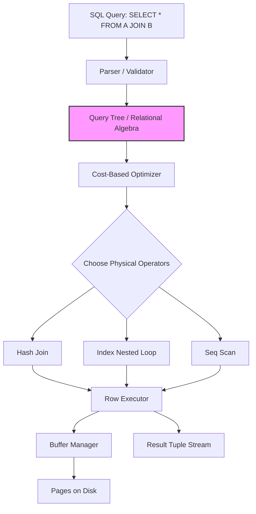

## Why This Exists

The relational model exists to achieve **physical data independence**. Before it, applications had to know the exact navigational path (pointers, linked lists) through the storage medium to fetch data. Edgar Codd’s relational model separated *what* data you want from *how* it is stored, abstracting the physical implementation behind a mathematical foundation of sets and relations. This allows you to change indexes, partition tables, or rewrite the entire storage engine without rewriting a single application query.

## Core Concept

The relational model organizes data into **relations** (tables)—unordered sets of **tuples** (rows) with atomic **attributes** (columns). Each attribute belongs to a **domain** (like `INT` or `VARCHAR`), defining the permissible values. The real power comes from **constraints**: **Entity Integrity** (every tuple must have a unique, non-null primary key to distinguish it), and **Referential Integrity** (foreign keys must point to valid existing primary keys). Queries are expressed declaratively, meaning you specify the desired result set (using SQL), and the database system figures out the optimal procedural steps (via relational algebra) to retrieve it.

## Internal Working

Internally, the relational model dictates the entire lifecycle of a query—from your keyboard to the disk. Here’s the execution flow under the hood:

1.  **Parser & Validator**: The SQL string is parsed into an abstract syntax tree (AST). The validator checks if relations and attributes exist, verifies data types, and ensures the user has permissions. It then resolves all identifiers to internal object IDs.
2.  **Relational Algebra Translation**: The parser converts the SQL (declarative) into an internal **Relational Algebra** representation. This is a procedural set of operators: `σ` (Selection), `π` (Projection), `⨝` (Join), `∩` (Intersection), etc. Each SQL clause maps to an operator node in a query tree.
3.  **Optimizer (The Heart)**: The query tree enters the cost-based optimizer. The optimizer leverages database statistics (table cardinalities, column value distributions, index heights) to determine the most efficient physical execution plan. It does this by:
    - **Transforming** the query tree (e.g., pushing `σ` down the tree before `⨝` to reduce the dataset early).
    - **Enumerating join orders** (e.g., `A JOIN B` vs `B JOIN A`) and join algorithms (Nested Loop, Hash Join, or Sort-Merge Join).
    - Assigning a **cost** (I/O + CPU) to each candidate plan and selecting the cheapest.
4.  **Executor (Row Iterators)**: The executor receives the final plan, which is a tree of iterator objects (also called Volcano-style processing). Each operator (`Scan`, `Filter`, `Join`) implements a `get_next()` function. The root operator pulls rows from its children, which recursively pull from leaf operators that physically retrieve data from the storage engine's buffer pool.
5.  **Storage Layer**: Under the physical layer, the storage engine manages pages on disk. It uses a buffer pool (LRU caching) to minimize disk I/O. Indexes (B-Trees or Hash tables) allow the scan operators to bypass full table scans and directly locate the required disk pages.

## Real-World Use Case

- **Named Company (Stripe)**: Stripe’s core financial ledger is built on PostgreSQL. Every single transaction, balance update, and payout is governed by the relational model. They rely heavily on **ACID transactions** and **Referential Integrity** to guarantee that money is never created or destroyed, and that a `charge` always references a valid `customer` and `payment_method`. If a reconciliation job fails halfway, the relational model's transaction isolation ensures the state reverts cleanly, preventing double-accounting.
- **Generic Industry Scenario (Airline Reservation System)**: A flight booking system uses the relational model to enforce strict business rules. The `Seat_Allocation` table has a composite foreign key referencing both `Flight` and `Passenger`. The system uses a `UNIQUE` constraint on (`flight_id`, `seat_number`) to guarantee two passengers cannot be assigned the same seat on the same flight—this is enforced at the database kernel level, preventing race conditions even under massive concurrent booking traffic.

## Mental Model

Think of the relational model as a **Google Sheets power-user setup**, but on a global scale. Each sheet in the workbook is a relation (table). Every row is a data point (tuple), and every column has a strict data type (domain). The magic is the `VLOOKUP` or `INDEX/MATCH`—this is your **Foreign Key**. You ensure data integrity by using "Data Validation" (constraints), preventing users from entering invalid IDs. When you write a complex formula (your SQL), Google Sheets calculates the result. The relational model is simply the strict set of rules that makes this spreadsheet mathematically sound and scalable, even when millions of users are editing it simultaneously.

## Diagram



## Syntax & Example

Here is a standard DDL and a query, with the underlying Relational Algebra operations explained in comments.

```sql
-- 1. Schema Definition (DDL) enforcing Entity & Referential Integrity
CREATE TABLE department (
    dept_id INT PRIMARY KEY,        -- Entity Integrity: unique, non-null
    name VARCHAR(100) NOT NULL
);

CREATE TABLE employee (
    emp_id INT PRIMARY KEY,
    name VARCHAR(100),
    salary DECIMAL(10,2),
    dept_id INT,
    -- Referential Integrity: Every dept_id must exist in department
    FOREIGN KEY (dept_id) REFERENCES department(dept_id) ON DELETE SET NULL
);

-- 2. Query: Find names of employees in the 'Engineering' department earning > 80k
SELECT e.name, e.salary
FROM employee e
JOIN department d ON e.dept_id = d.dept_id
WHERE d.name = 'Engineering'
  AND e.salary > 80000;

-- Under the hood, the optimizer translates this into Relational Algebra:
-- π(name, salary)           (Projection: select only required columns)
--   ⨝ (e.dept_id = d.dept_id) (Theta Join: combine employee and dept on FK)
--     σ (d.name = 'Engineering' AND e.salary > 80000) (Selection: filter rows)
--       (employee × department) (Cross product of the two relations)
```

## Gotchas / Common Confusions

1.  **Relations are Sets, but SQL is Multiset**: In pure relational theory, duplicate rows are impossible (a set). However, SQL tables are *multisets* (bags) and allow duplicates unless a `PRIMARY KEY` or `UNIQUE` constraint is defined. A `SELECT * FROM employee` can return duplicate rows if no PK exists, breaking the pure relational definition.
2.  **Three-Valued Logic (NULLs)**: In classical relational logic, comparisons are two-valued (True/False). SQL introduces `NULL` for unknown values, making comparisons three-valued (True/False/Unknown). A `WHERE salary > 0` will exclude rows where `salary IS NULL`, because `NULL > 0` evaluates to `Unknown`, which is treated as False. This catches many engineers off guard.
3.  **Foreign Key Cyclic Dependencies**: Modeling relationships both ways (e.g., `Employee` has a `manager_id` referencing `Employee`, and `Manager` has a `dept_id` referencing `Department`) can create chicken-and-egg insertion problems. The solution is to make one constraint `DEFERRABLE` (validated at commit, not per-row) or redesign the schema.
4.  **Logical vs. Physical Optimization**: Just because the relational model separates *logical* design from *physical* storage, the *performance* of your logical design entirely depends on the physical choices (indexes, partition keys). A perfectly normalized 6NF schema is logically pure but may be physically unusable for high-throughput OLTP, leading to necessary denormalization in production.
5.  **Confusing `DROP` behaviors**: `ON DELETE CASCADE` automatically removes dependent rows, while `ON DELETE SET NULL` preserves them. `RESTRICT` (or `NO ACTION`) prevents deletion if dependents exist. Interviewers often test if you know the implications of these choices on data integrity.

## Interview Angle

1.  **Q: What is the fundamental difference between the Relational Model and other models (like Document or Network)?**
    - *Hint:* It provides data independence and a declarative query language (SQL) based on mathematical set theory, rather than requiring procedural navigation through pointers.
2.  **Q: Explain Entity Integrity vs. Referential Integrity with examples.**
    - *Hint:* Entity = PK must be unique and non-null. Referential = FK must match an existing PK in the parent table (or be null). Prevents orphan records.
3.  **Q: Why do most SQL databases allow duplicate rows when the relational model forbids them?**
    - *Hint:* Performance. Maintaining uniqueness across a multi-column tuple during every insert requires checking the entire table, which is expensive. SQL treats data as bags for pragmatic efficiency.
4.  **Q: How does a query optimizer decide whether to use a Hash Join or a Nested Loop Join?**
    - *Hint:* Nested Loop is best for small outer sets with an index on the inner set. Hash Join is best for large, unsorted datasets where it builds a hash table for the smaller set in memory.
5.  **Q: What is a candidate key and how does it differ from a super key and a primary key?**
    - *Hint:* Super key = any set of attributes uniquely identifying a row. Candidate key = minimal super key (no redundant columns). Primary key = one chosen candidate key.
6.  **Q: What happens inside the database when you run `UPDATE employee SET salary = salary * 1.1`?**
    - *Hint:* The parser checks syntax, the optimizer creates a plan (likely a full table scan), the executor writes the updated tuples to a new location (MVCC) or modifies in-place with a WAL log, and records are locked to maintain isolation.
7.  **Q: Can a foreign key reference a unique key instead of a primary key?**
    - *Hint:* Yes! The `REFERENCES` clause can point to any column(s) with a `UNIQUE` constraint. It does not strictly have to be the primary key.
8.  **Q: What is the "N+1" query problem and is it related to the relational model?**
    - *Hint:* While often an ORM issue, it stems from traversing relationships row-by-row (iterative queries) instead of performing a single join. A well-designed relational query joins the data once, fixing the problem.

## Quick Recall

**"S-A-C-I-D" for Relational** : **S**ets + **A**lgebra (the math) enforce **C**onstraints (PK/FK), providing **I**ndependence (physical/logical) via a **D**eclarative interface (SQL). The database handles the "How"—you just tell it the "What".