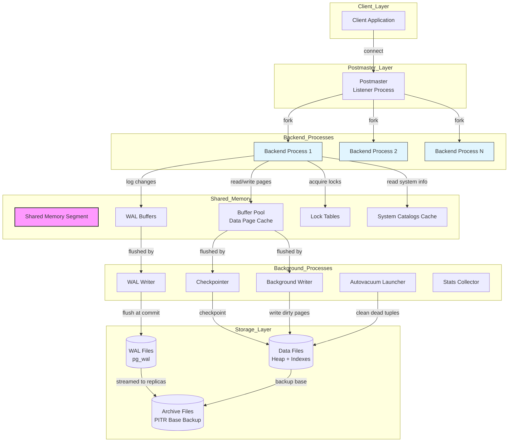

Here is the study note on **PostgreSQL Architecture**, formatted exactly as requested and ready for your Obsidian vault.

---

## Why This Exists

PostgreSQL's architecture exists to solve the "enterprise vs. lightweight" trade-off. Most databases force you to choose: either you get ACID compliance and extensibility with high overhead, or you get speed and simplicity with relaxed guarantees. PostgreSQL's process-per-connection, shared-memory architecture was designed to deliver **enterprise-grade reliability** (crash recovery, point-in-time recovery, full ACID) without sacrificing the **extensibility** needed for modern workloads (JSON, full-text search, custom data types). It's the architect's Swiss Army knife—complex under the hood, but gives you the tools to build anything from a simple blog to a financial ledger.

## Core Concept

PostgreSQL is a **client-server** relational database system that uses a **process-per-connection** model rather than thread-per-connection. Each client connection spawns a separate backend process (a `postgres` process) that handles all queries for that session. The architecture is divided into three main layers:

1.  **Process Layer**: The `postmaster` (supervisor process) listens for new connections, spawns background workers (like the WAL writer, autovacuum launcher, stats collector), and forks backend processes for each client.
2.  **Memory Layer**: A **Shared Memory** segment (allocated at startup) contains the **Buffer Pool** (cached data pages), **WAL Buffers** (transaction logs), and **Lock Tables** (for concurrency control). Each backend process also has its own **Local Memory** for sorting and temporary tables.
3.  **Storage Layer**: Data is organized into **tablespaces** (directories containing files). Each table is stored as a heap file (`.data`), with associated free-space map (`.fsm`) and visibility map (`.vm`). Indexes are stored in separate files. The **Write-Ahead Log (WAL)** in `pg_wal` provides durability and crash recovery.

The magic is in how these layers interact: writes go first to WAL for durability, then to the buffer cache for performance; reads check the buffer cache first, then fetch from disk; and MVCC (Multi-Version Concurrency Control) allows readers and writers to coexist without locking each other.

## Internal Working

Here's what actually happens under the hood when you run a query in PostgreSQL:

### Connection & Query Lifecycle

1.  **Connection Handling**: The `postmaster` listens on port 5432. When a client connects, it performs authentication, then `fork()`s a new `postgres` backend process. This process inherits the shared memory segment and initializes its local memory structures.
2.  **Query Parsing**: The backend parses the SQL into a **parse tree**, checks syntax and semantics, and validates table/column existence against the system catalogs (`pg_class`, `pg_attribute`).
3.  **Rewrite & Planning**: The **rewriter** transforms views and rules into raw table references. The **planner** generates multiple candidate execution plans, consults the **statistics** (`pg_statistic`—histograms, most-common values), and assigns a cost to each plan (measured in arbitrary units based on I/O + CPU). It selects the cheapest plan.
4.  **Execution**: The **executor** receives the plan—a tree of plan nodes (`SeqScan`, `IndexScan`, `HashJoin`, `Aggregate`). It uses the **Volcano iterator model**: each node implements `ExecProcNode()`, which pulls rows from its children, processes them, and returns a tuple to its parent. The executor interacts with the **Buffer Manager** to read/write pages.
5.  **Write Path (INSERT/UPDATE/DELETE)**: This is where ACID gets enforced:
    - **MVCC**: Instead of updating rows in-place, PostgreSQL marks the old tuple as invisible and creates a new tuple with new `xmin` (transaction ID that created it) and `xmax` (transaction ID that deleted it). This allows concurrent readers to see a consistent snapshot.
    - **WAL**: Before any buffer page modification, the change is written to the WAL buffer. At transaction commit, the WAL buffer is flushed to the WAL file on disk (`pg_wal`) via the `wal_sync_method` (usually `fsync`). This guarantees durability (crash recovery can replay the WAL).
    - **Buffer Cache**: The dirty page containing the new tuple is kept in the shared buffer cache. It's eventually written to the actual data file by the **background writer** or **checkpointer**.
6.  **Background Processes**:
    - **Autovacuum Launcher**: Periodically wakes up and triggers `VACUUM` on tables with high dead tuple counts. `VACUUM` reclaims storage and updates the **visibility map**, which helps index-only scans.
    - **WAL Writer**: Flushes WAL buffers to disk periodically (not just at commit) to keep the WAL size manageable.
    - **Checkpointer**: Writes all dirty buffers to disk at regular intervals (checkpoint), creating a recovery point. If the system crashes, recovery starts from the last checkpoint, replaying WAL records after that point.

### MVCC Internals (The Deep Dive)

Every row in PostgreSQL has four hidden system columns: `xmin`, `xmax`, `cmin`, `cmax`. When a transaction starts, it gets a unique `TransactionId` (XID). These are 32-bit integers that wrap around after ~2 billion transactions.

- **INSERT**: Sets `xmin` = current XID, `xmax` = 0.
- **DELETE**: Sets `xmax` = current XID (logical deletion).
- **UPDATE**: Creates a new tuple with `xmin` = current XID; marks the old tuple with `xmax` = current XID.

**Visibility Check**: A tuple is visible to a transaction if:
- `xmin` is committed AND (the transaction is still running or committed) AND `xmin` < snapshot's `xmin`.
- AND (`xmax` = 0 OR `xmax` is not committed OR `xmax` >= snapshot's `xmin`).

**Transaction Snapshot**: Each `SERIALIZABLE` or `REPEATABLE READ` transaction takes a snapshot of all currently running XIDs at its start. This snapshot is used for visibility checks, ensuring a consistent view throughout the transaction.

**VACUUM**: Periodically, VACUUM scans tables, removes tuples that are dead (committed `xmax`), and marks the space as reusable. This prevents transaction ID wraparound (if XID reaches its limit, the database shuts down to prevent data corruption).

## Real-World Use Case

- **Named Company (Instagram)**: Instagram uses PostgreSQL as their primary data store for all user data, posts, and relationships. They leverage PostgreSQL's **MVCC** to handle millions of concurrent reads and writes without locking issues. Their **sharding** strategy (using the `postgres_fdw` extension) allows them to partition data across hundreds of instances while still enforcing referential integrity. They use **WAL shipping** for replication to read replicas, ensuring high availability for their global user base. The **autovacuum** process is heavily tuned to handle their massive write load (billions of likes and comments) without bloating tables.
- **Generic Industry Scenario (FinTech Ledger System)**: A payment processing platform uses PostgreSQL for its **Atomicity** (transactions are all-or-nothing) and **Isolation** (via `SERIALIZABLE` isolation level). When a user transfers money, the transaction updates two accounts in a single `BEGIN...COMMIT`. PostgreSQL's **WAL** ensures that in case of a power failure, the transaction is either fully committed or fully rolled back. The **point-in-time recovery** (PITR) feature allows restoring the database to a specific second before a logical corruption event, which is critical for financial auditing and compliance.

## Mental Model

Imagine PostgreSQL as a **massive, highly-organized library** with a strict check-out system.

- The **Postmaster** is the **front desk manager** who greets every patron (client), verifies their library card (authentication), and assigns a dedicated **librarian** (backend process) to help them.
- The **shared buffer pool** is the **reading room desk**—librarians put recently accessed books (data pages) here for quick reference, so no one has to run to the shelves every time.
- The **WAL (Write-Ahead Log)** is the **library's check-out logbook**. Every time a book is moved, the librarian writes it in the logbook *before* physically moving the book. If the library burns down, they can reconstruct the state from the logbook and the last backup.
- **MVCC** is the **"snapshot" copy machine**. If one patron is reading a book, and another wants to edit it, the editor doesn't erase the original—they take a photocopy (new tuple), mark the original as "don't display to others" (xmax), and hand out the photocopy to future readers. The original reader keeps their copy, blissfully unaware of changes.
- **Autovacuum** is the **shelving crew**. They periodically go through the library, collect all the "don't display" marked books, throw them out, and reorganize the shelves to reclaim space.

## Diagram



## Syntax & Example

Here's a practical demonstration of PostgreSQL internals: viewing transaction IDs, checking visibility, and understanding the WAL.

```sql
-- 1. Inspect the hidden system columns (MVCC internals)
SELECT 
    xmin,          -- Transaction ID that created this tuple
    xmax,          -- Transaction ID that deleted/invalidated this tuple
    ctid,          -- Physical location (page, offset) of this tuple
    *              -- All user-defined columns
FROM employee 
WHERE emp_id = 101;

-- Example output before any updates:
-- xmin = 4892 (transaction that inserted), xmax = 0, ctid = (0,1)

-- 2. Start a transaction and see MVCC in action
BEGIN;
UPDATE employee SET salary = 90000 WHERE emp_id = 101;
-- Now, the old tuple has xmax = current XID (say, 5010)
-- The new tuple has xmin = 5010, xmax = 0

-- In a separate session, check the old tuple is still visible to concurrent readers:
-- If that session's snapshot was taken before XID 5010 committed, it will see the old tuple.
COMMIT; -- Now the old tuple becomes dead; VACUUM will eventually remove it.

-- 3. Check current transaction ID (useful for debugging wraparound)
SELECT txid_current();

-- 4. Inspect WAL status (requires superuser)
SELECT 
    pg_current_wal_lsn(),              -- Current WAL write position
    pg_walfile_name(pg_current_wal_lsn()); -- Name of active WAL file

-- 5. View live stats from the buffer cache (requires pg_buffercache extension)
CREATE EXTENSION IF NOT EXISTS pg_buffercache;
SELECT 
    relname,
    COUNT(*) AS buffers_used,
    round(COUNT(*) * 100.0 / (SELECT setting::int FROM pg_settings WHERE name = 'shared_buffers'), 2) AS percentage
FROM pg_buffercache b
JOIN pg_class c ON b.relfilenode = pg_relation_filenode(c.oid)
GROUP BY relname
ORDER BY buffers_used DESC
LIMIT 10;

-- 6. Use EXPLAIN to see the plan the optimizer generated
-- Note the "cost=" metric: startup cost + total cost (arbitrary units)
EXPLAIN (ANALYZE, BUFFERS, VERBOSE) 
SELECT * FROM orders WHERE order_date > '2024-01-01' AND total_amount > 1000;
-- This will show:
-- - Seq Scan vs. Index Scan decisions
-- - Buffers: shared hit (from cache) vs. read (from disk)
-- - Actual execution time in milliseconds
```

## Gotchas / Common Confusions

1.  **PostgreSQL uses processes, not threads**: Many engineers coming from MySQL or Oracle assume PostgreSQL is threaded. PostgreSQL spawns a separate OS process for every connection, which means higher memory overhead per connection (~2-10MB). Connection pooling is *critical* for high-concurrency applications. The process model, however, provides better fault isolation—a crash in one backend doesn't take down the entire system.
2.  **VACUUM vs. VACUUM FULL**: This is a massive trap. `VACUUM` marks dead tuples as reusable and updates the visibility map—it returns space to the table's free space map but does *not* shrink the file on disk. `VACUUM FULL` actually compacts the table, shrinking the file, but requires an `ACCESS EXCLUSIVE` lock on the table, blocking all reads and writes. Many engineers run `VACUUM FULL` in production thinking it's safe, causing outages. The correct tool for routine maintenance is `VACUUM` (or autovacuum).
3.  **Transaction ID Wraparound (The "Iceberg" Threat)**: PostgreSQL uses 32-bit XIDs. If you don't run `VACUUM` often enough, the XID counter wraps around, and old transactions suddenly appear "in the future." This causes data loss and forces the database into read-only emergency mode. Many DBAs neglect `autovacuum` tuning and get bitten by this at scale. Monitoring `pg_stat_activity` and `age(pg_database.datfrozenxid)` is essential.
4.  **`SERIALIZABLE` vs. `REPEATABLE READ`**: In PostgreSQL, `REPEATABLE READ` uses snapshot isolation—it prevents dirty reads and non-repeatable reads, but allows serialization anomalies (e.g., write skew). `SERIALIZABLE` uses Snapshot Isolation with Serializable Snapshot Isolation (SSI) and detects conflicts, throwing `SERIALIZATION_FAILURE` errors. Many developers use `SERIALIZABLE` thinking it's the "safest," but don't handle retry logic, leading to mysterious application failures.
5.  **`fsync` and WAL Durability**: PostgreSQL's durability depends on the OS's `fsync()` correctly writing to disk. If you disable `fsync` in `postgresql.conf` (for performance testing), you lose crash-safety guarantees. In cloud environments with network-attached storage (like AWS EBS), `fsync` can be slow, but disabling it is a recipe for corruption if the host crashes. The trade-off is between performance and durability—use `commit_delay` and `commit_siblings` to batch WAL flushes without sacrificing safety.

## Interview Angle

1.  **Q: What is MVCC in PostgreSQL and how does it work?**
    - *Hint:* Uses `xmin` and `xmax` hidden columns. Readers don't block writers; readers see a snapshot of the database at the start of their transaction. `VACUUM` cleans up dead tuples.
2.  **Q: Why does PostgreSQL use a process-per-connection model instead of threads?**
    - *Hint:* Process model offers better fault isolation, simpler memory management, and full OS-level security per connection. However, it has higher memory overhead, so connection pooling is essential.
3.  **Q: What happens if autovacuum fails to keep up with write traffic?**
    - *Hint:* Table bloat (space not reused), poor query performance, and eventually, transaction ID wraparound which puts the database in emergency read-only mode.
4.  **Q: Explain the Write-Ahead Log (WAL) and its role in crash recovery.**
    - *Hint:* Every data modification is logged before it's written to the data file. On crash, PostgreSQL replays WAL from the last checkpoint to restore consistency. It also enables replication and point-in-time recovery.
5.  **Q: What is the difference between `VACUUM` and `ANALYZE`?**
    - *Hint:* `VACUUM` reclaims storage from dead tuples. `ANALYZE` updates table statistics used by the planner to choose optimal query plans. They are often run together (`VACUUM ANALYZE`) but serve distinct purposes.
6.  **Q: How does PostgreSQL handle concurrency? What isolation levels does it support?**
    - *Hint:* Uses MVCC. Supports `READ COMMITTED`, `REPEATABLE READ`, `SERIALIZABLE`, and `READ UNCOMMITTED` (which acts like `READ COMMITTED`). `REPEATABLE READ` uses snapshot isolation; `SERIALIZABLE` uses SSI with conflict detection.
7.  **Q: What is a checkpoint and why is it important?**
    - *Hint:* A checkpoint is the point where all dirty buffers are flushed to disk. It reduces recovery time by creating a base point from which only subsequent WAL records need to be replayed.
8.  **Q: How does the query planner decide between a Seq Scan and an Index Scan?**
    - *Hint:* Uses statistics (`pg_statistic`) to estimate the number of rows satisfying the predicate. If the estimated rows exceed ~5-10% of the table, a Seq Scan is often cheaper because Index Scans involve random I/O. `enable_seqscan` and cost parameters can influence this.

## Quick Recall

**"P-M-W-A-C" for PostgreSQL** : **P**rocesses (forked backends) + **M**VCC (hidden XIDs) + **W**AL (write-ahead logging) + **A**utovacuum (space reclamation) + **C**heckpoints (recovery base). Or simpler: **"ACID is enforced by WAL + MVCC; performance is saved by Buffer Cache + Autovacuum."**